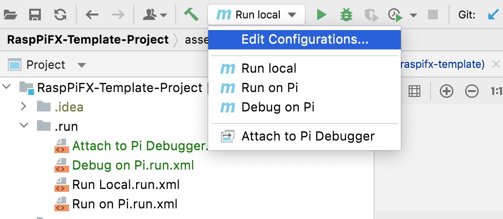
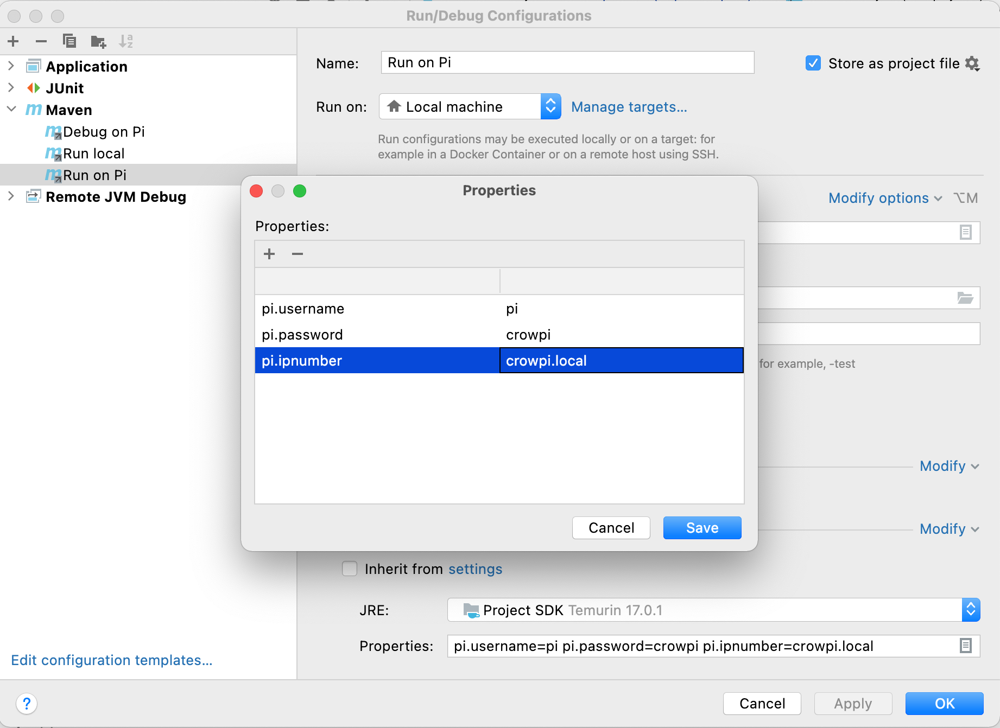

# Pi4J Applikationen mit JavaFX-basiertem GUI

## neues GitLab-Repository anlegen

Sie sollten unter Ihrem GitLab Account ein neues Repository anlegen und dieses Template-Respository als "Quelle" angeben.

todo: Genauer beschreiben.

## Voraussetzungen

Auf dem Entwickler-Laptop

* [Java 11](https://adoptium.net/?variant=openjdk11&jvmVariant=hotspot). Auf dem Raspberry Pi wird die Verwendung von JDK 11 empfohlen. Daher verwenden wir diesen auch auf dem Laptop. Hinweis für Mac-Benuter: Die Verwendung von sdkman (s.u.) für die Installation und die Verwaltung von JDKs ist sehr empfehlenswert.

* [IntelliJ IDEA 2021.2](https://www.jetbrains.com/idea/download/). Es ist wichtig, diese neueste Version zu verwenden. Am besten via [JetBrains Toolbox](https://www.jetbrains.com/toolbox-app/) installieren. Empfehlenswert ist die Verwendung der Ultimate Edition. Studierende erhalten, nach Anmeldung, eine kostenlose Lizenz. Registrieren Sie sich unter [https://www.jetbrains.com/student/](https://www.jetbrains.com/student/) mit Ihrer FHNW E-Mail-Adresse. Für die Community-Edition benötigt man keine Lizenz.

* [Git](https://git-scm.com/downloads). Als Sourcecode-Repository verwenden wir git. 

* [GitLab-Account](https://gitlab.fhnw.ch/). Verwenden Sie ihren FHNW Gitlab Account. 

* `ssh`. Die Verbindung zum Raspberry Pi wird mit `ssh` hergestellt. Ist normalerweise auf allen Laptops vorinstalliert.

## Empfehlung zur Installation des JDK für MAC (und LINUX)

Für Mac und Linux gibt es ein sehr empfehlenswertes Tool zur Verwaltung unterschiedlicher Software Development Kits: [SDKMAN](https://sdkman.io)

Insbesondere wenn, wie üblich, mehrere Java JDKs verwendet werden sollen, hilft SDKMAN.

Sie können natürlich auch weiterhin die "normalen" Installationsmöglichkeiten verwenden.

### Installation von SDKMAN:
Folgenden Befehl in einem Terminal eingeben:

`export SDKMAN_DIR="$HOME/sdkman" && curl -s "https://get.sdkman.io" | bash`

Falls Sie SDKMAN bereits früher installiert haben, müssen Sie SDKMAN auf den neuesten Stand bringen:

`sdk update`

### Installation von JDK 11 
In einem neuen Terminal-Window diesen Befehl eingeben:

`sdk install java 11.0.13-tem`

Danach liegt der JDK in ihrer Home-Directory im Folder `sdkman/candidates/java`. Von dort können Sie es dann in IntelliJ als neuen SDK anlegen und im Projekt verwenden.

Mit: 

`sdk ls java`

können Sie sich auflisten lassen welche anderen JDKs zu Installation zur Verfügung stehen.

## Raspberry Pi vorbereiten
Verwenden Sie das vom Pi4J-team vorbereitete CrowPi-Image.
- [Download CrowPi Image](https://pi4j-download.com/latest.php?flavor=crowpi)
- zip-File auspacken, mit [Raspberry Pi Imager](https://www.raspberrypi.org/blog/raspberry-pi-imager-imaging-utility/) eine SD-Card bespielen und damit den Raspberry Pi starten

Das CrowPi-Image enthält bereits alle notwendige Installationen für JavaFX/Pi4J-Applikationen.

## Verbindung zum Raspberry Pi herstellen
Der Laptop und der Raspberry Pi müssen das gleiche WLAN verwenden.

Eine einfache Variante dies sicherzustellen ist das Aufsetzen eines Hotspots auf einem Smartphone, idealerweise mit diesen Parametern:

- ssid: `Pi4J-Spot`
- password: `MayTheCodeBeWithYou!`

Auf diesen Hotspot connected sich der RaspPi mit dem CrowPi-Image automatisch und zeigt die IP-Nummer im Hintergrundbild an.

Den Laptop ebenfalls mit dem Pi4J-Spot verbinden.

In einem Terminal-Window des Laptops:

`ssh pi@<ip.number>`

z.B.
`ssh pi@192.168.183.86`
 
Passwort: `crowpi`

## Build System

Dieses Projekt verwendet Maven, um die verschiedenen Applikationen zu bauen und entweder lokal auf dem Laptop oder auf der Raspberry Pi auszuführen.

Die Artefakte werden dabei auf dem Laptop gebaut, anschliessend auf den Raspberry Pi kopiert und dort gestartet.

Dazu müssen nur wenige Konfigurationen verändert werden.

### Einstellungen im `pom.xml`

- **`launcher.class` (required):** gibt an, welche Applikation gestartet werden soll. Im `pom.xml` ist bereits eine Liste von Kandidaten enthalten. Man muss nur bei der jeweils gewünschte Applikation die Kommentare entfernen.
- **`pi.ipnumber` (optional):** Die aktuelle IP-Nummer des Raspberry Pi, z.B. `192.168.1.2`, wird für SCP/SSH benötigt. 

Mit diesen Einstellungen kann die Applikation mittels Maven-Befehl auf dem Raspberry Pi gestartet werden. Besser ist es jedoch, die Run-Configurationen von IntelliJ zu verwenden.

### Einstellungen in den Run-Konfigurationen

Im Projekt sind 2 Run-Konfigurationen vordefiniert
- `Run Local` startet das Programm, das in `launcher.class` eingestellt wurde, auf dem Laptop. Wird vor allem während der GUI-Entwicklung gebraucht (also noch ohne die Verwendung von an den Raspberry Pi angeschlossenen Sensoren und Aktuatoren).
- `Run on Pi` startet das Programm auf dem Rasberry Pi.

In `Run on Pi` muss jeweils die IP-Adresse des RaspPi eingestellt werden. Dazu  `Edit Configurations` wählen. 

Im nun geöffnenten Dialog den Tab `Runner` öffnen und `pi.ipnumber` doppelklicken. Danach öffnet sich das Dialogfenster zur Eingabe der IP-Adresse. 

## Die enthaltenen Beispiel-Programme

### HelloFX
Dient ausschliesslich der Überprüfung der JavaFX-Basis-Installation. Auf keinen Fall als Vorlage für die eigenen JavaFX-Applikationen verwenden.

Zum Starten:
- `launcher.class` im `pom.xml` auswählen
  - `<launcher.class>com.pi4j.fxgl/com.pi4j.jfx.jfxplain.HelloFX</launcher.class>`
- mit `Run local` auf dem Laptop starten
- mit `Run on Pi` auf dem RaspPi starten

### Wiring
Die beiden anderen Beispielprogramme verwenden eine LED und einen Button. Diese müssen folgendermassen verdrahtet werden:

### MinimalPi4J
Ist eine reine Pi4J-Applikation ohne GUI. Dient ebenfalls ausschliesslich der Überprüfung des Setups.

Zum Starten:
- `launcher.class` im `pom.xml` auswählen
  - `<launcher.class>com.pi4j.fxgl/com.pi4j.pi4jplain.MinimalPi4J</launcher.class> `
- `Run local` macht für dieses Beispiel keinen Sinn. An den Laptop sind weder Button noch LED angeschlossen
- mit `Run on Pi` auf dem RaspPi starten

Wenn der Button gedrückt wird, wird eine entsprechende Meldung auf dem Bildschirm ausgegeben.

### ExampleApp

Zeigt das Zusammenspiel eines JavaFX-basiertes Graphical-User-Interfaces (GUI) mit an den RaspPi angeschlossenen Sensoren und Aktuatoren, dem Physical-User-Interface (PUI).

Es ist gleichzeitig ein konkretes Beispiel und eine Vorlage für Ihre eigene Applikation. Das umfasst auch die enthaltenen TestCases.

Sie sollten zunächst das Beispiel kennenlernen und verstehen. Für Ihre eigene Applikation sollten Sie das Beispiel kopieren und entsprechend abändern, ohne dabei die Grundstruktur zu verändern. 

Zum Starten:
- `launcher.class` im `pom.xml` auswählen
  - `<launcher.class>com.pi4j.fxgl/com.pi4j.jfx.exampleapp.AppStarter</launcher.class>`
- mit `Run local` auf dem Laptop starten. Sinnvoll für die GUI-Entwicklung. Das PUI steht auf dem Laptop nicht zur Verfügung. Das GUI kann jedoch weitgehend ohne Einsatz den RaspPis entwickelt werden 
- mit `Run on Pi` auf dem RaspPi starten (jetzt natürlich inklusive PUI)

### Das Presentationmodel-Konzept

todo: fehlt noch

Dieses Konzept wird ausführlich in OOP2 besprochen und eingeübt. Die `ExampleApp` verwendet das gleiche Konzept und erweitert es um ein PUI.

GUI und PUI sollten auf keinen Fall direkt miteinander verknüpft werden. Stattdessen wird ein Presentation-Model verwendet, das wie eine Informations-Drehscheibe wirkt.

### Junit Tests

todo: fehlt noch

### Für das Presentation-Model

todo: fehlt noch

### Für die Components

todo: fehlt noch

### Für das PUI
todo: fehlt noch

## LICENSE

This repository is licensed under the Apache License, Version 2.0 (the "License"); you may not use this file except in compliance with the
License. You may obtain a copy of the License at: http://www.apache.org/licenses/LICENSE-2.0

Unless required by applicable law or agreed to in writing, software distributed under the License is distributed on an "AS IS" BASIS,
WITHOUT WARRANTIES OR CONDITIONS OF ANY KIND, either express or implied. See the License for the specific language governing permissions and
limitations under the License.

